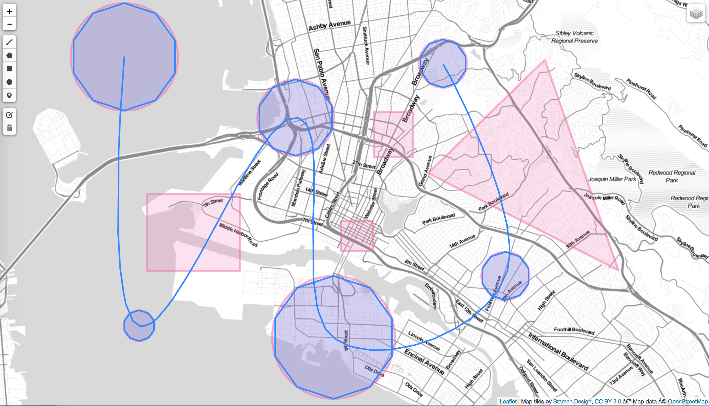

# GEOSANDBOX: BUILDING CURIOUS GEOGRAPHIC GEOMETRIES ON THE WEB 
with Joey Lee

This [workshop] provides a sandbox for participants to engage in the process of geographic data creation. Using opensource web based mapping tools such as Geojson.io and Turf.js, participants will make new geographic datasets through drawing and computation. The goal of the workshop is to help participants gain an understanding of the ways geoprocessing can be used in their own practices to produce new geometric forms and analyses. 

The outcome of the workshop will be a simple experimental map drawing app that is as complex or simple as the participant is comfortable.

## Requirements:
* own laptop
* enthusiasm for learning!

## Helpful to-have's, but not required:
* a nice text editor (e.g. [atom.io](http://atom.io/) or [sublimetext](https://www.sublimetext.com/))
* familiarity with html5

## Code of Conduct
See [CODE OF CONDUCT](CODEOFCONDUCT.md)

## Contributing
See [CONTRIBUTING](CONTRIBUTING.md)

# Workshop

## Agenda:
* short intro
* introduction to web mapping with leaflet.js and turf.js using the GeoSandBox
* introduction to building your own experimental mini map drawing app.
* facilitated working/learning time

## Setup
* Fire up your favorite [text editor]()
* Fire up the GeoSandBox

## Resources:
* [Geojson.io](http://geojson.io/)
* [Turf.js](http://turfjs.org/)
	* [Turfjs.party](Turfjs.party)
* [Leaflet.js](http://leafletjs.com/)
* [Mapbox.js Examples](https://www.mapbox.com/mapbox.js/example/v1.0.0/)

## Part I: The GeoSandBox

Please go to the [GeoSandBox](http://joeyklee.github.io/geosandbox/)

## Part II: Your own experimental mini map drawing app

As part of this workshop we will build our own playful, experimental mini map drawing app. We will combine our learnings from the GeoSandBox lessons on leaflet.js and turf.js to produce a map drawing app that is as simple or complicated as you feel like making. 

We will take advantage of keyboard events to trigger various functions that will take data that you've drawn and output another perhaps different or more interesting layer.

### Challenges?
* on a keyboard event - create a function that:
	* gets the `centroid` of each polygon you draw and then draws a `line` between those polygons.
	* generates random points or polygons in a bounding box.
	* draws lines between circles that intersect (tough 💪).
	* any suggestions?

## Part III: Share out and conclusion

Many thanks!